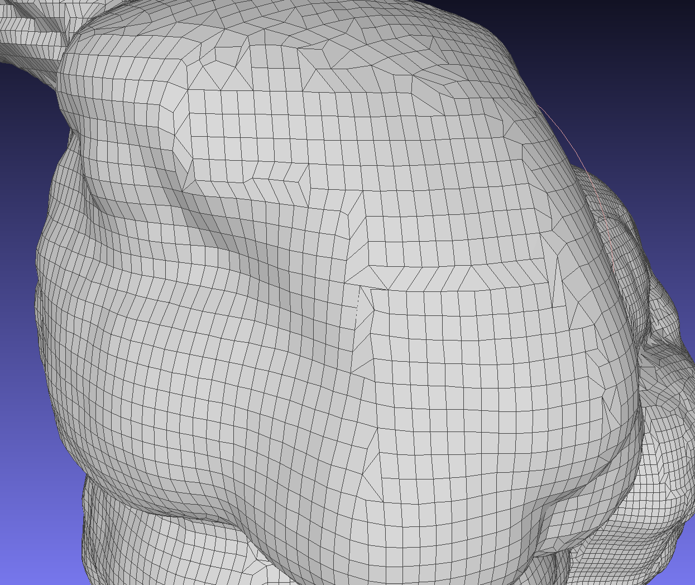
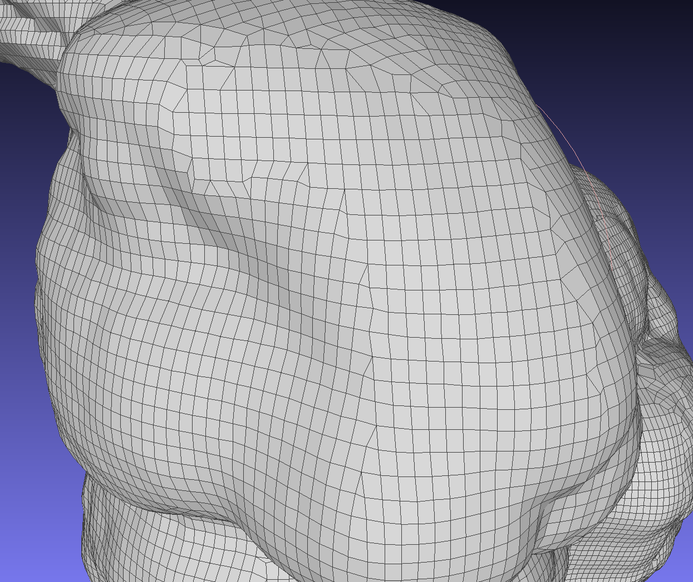
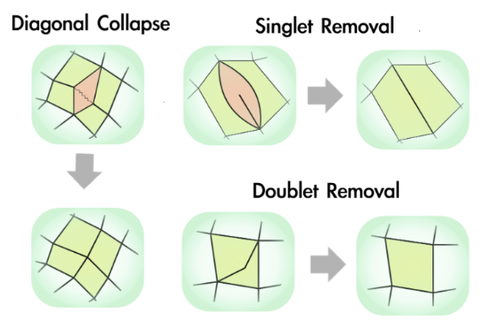
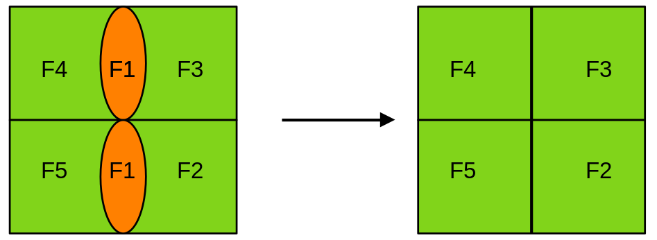
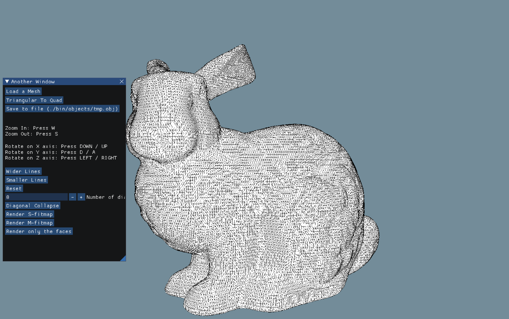
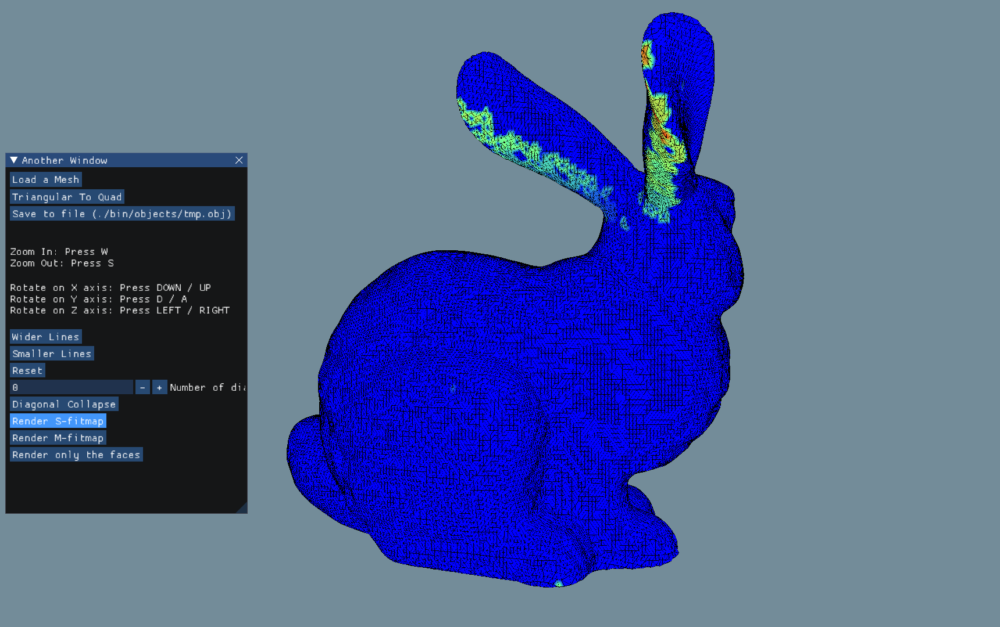
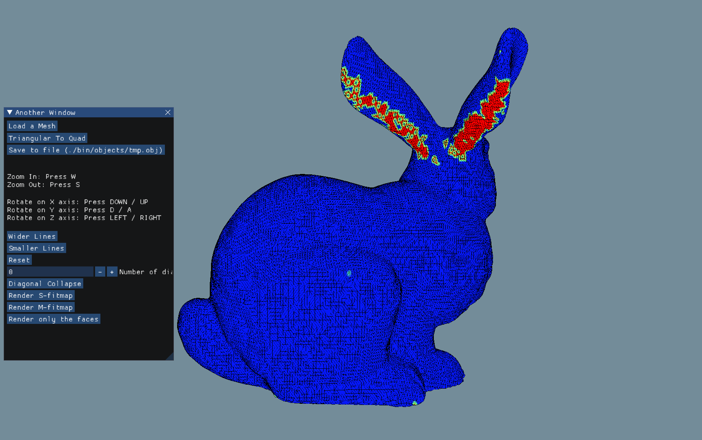
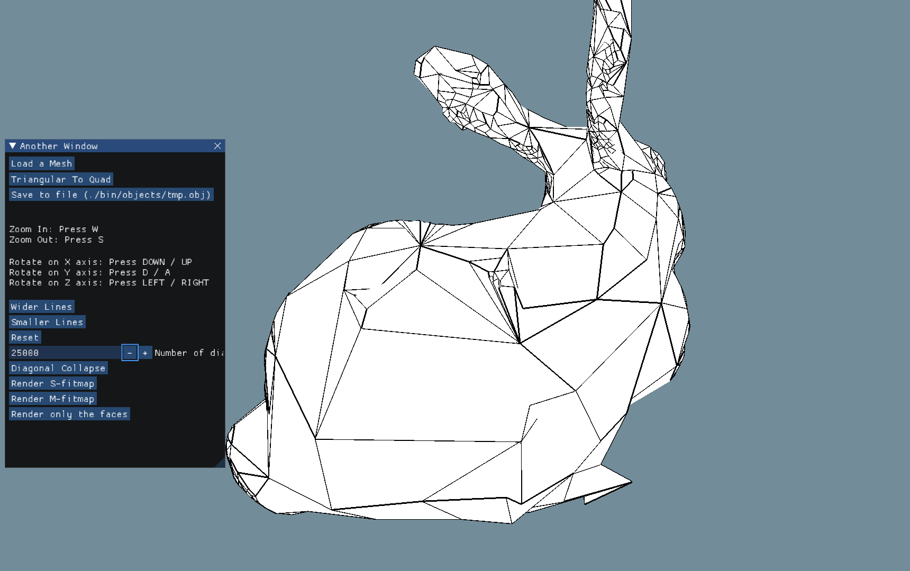
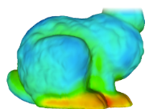
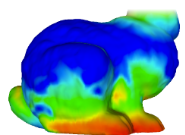

# AdaptiveQuadMesh

Implementation in C++ of an [adaptive quad mesh simplification algorithm](media/publications/adaptive_quad_mesh_simplification.pdf)

Repository: [AdaptiveQuadMesh](https://github.com/MrBigoudi/AdaptiveQuadMesh)

# Representing meshes

## Structure

We have used a winged mesh structure (inspired by [this page](https://pages.mtu.edu/~shene/COURSES/cs3621/NOTES/model/winged-e.html)) to represent our object internally. The mesh is composed of a `list of edges`, a `list of vertices` and a `list of faces`.

The faces and the vertices are represented by an `id` and `one of the edges` connected to them.

An edge is represented by an `id`, its `vertex origin`, its `vertex destination`, its `left face`, its `right face`, its `surrounding edges` and its `reversed edge`.

## File format

To import our object, we're using the standard `obj` format. A mesh is given as a string path to an object file and we begin by transforming it into a winged edge mesh using a technique adapted from [this](https://github.com/Jw-Jn/Mesh-Subdivision).

We can also save our mesh data structure into an `obj` file to be able to open it with different softwares like [`Meshlab`](https://github.com/cnr-isti-vclab/meshlab).

# Triangle mesh to quad mesh

Most of meshes comes as triangular so we must first implement a triangular to quad mesh conversion. We use the technique described in [this article](media/publications/practical_quad_mesh_simplification.pdf).

## Methode

We begin by transforming the input mesh into a quad dominant one by merging two by two neighbour triangles. For each triangle we select its best candidate edge to be dissolved, scoring each edge by the “squareness” of the corresponding quad, measured as the sum of pairwise dot products of the four normalized edges that would surround the new face. We then put each candidate into a min heap and for each element of the heap, we flag the edge if it is part of a triangle which didn't have an edge deleted yet.

To remove the remaining triangles we make them crall to each other. While we can find a triangle, we find the closest triangle to itself by doing a Breath First Search from the current triangle. We than swap quad and triangles along the path between the two triangles until the first two triangles meet up, then we remove the edge between them.

## Results

We can compare our results (left) with the one produced by Meshlab using the option `better quad shape` (right):

    
    

## Issues

For the first implementation of the algorithm, we had a really bad time 
complexity due to the BFS and the removal of all the components. To face 
the issue, we use a queue to make the BFS faster. Moreover, instead of 
creating a new face from scatch and adding it to our mesh after every merges,
we now just update an existing triangle. Finally, instead of removing elements 
during the conversion, we add a "toDelete" flag to every compenent and then 
just do the cleaning once the conversion over.

By doing so, on the Armadillo made of 100,000 faces, we went from a simplification
lasting one minute to one duing less than 10 seconds.

# Simplification algorithm

For the simplification, we follow the steps described in [this article](media/publications/adaptive_quad_mesh_simplification.pdf).

## Basic operations

Before doing any adaptive simplification, we've started by doing easier ones. For every faces of the mesh, we've added a diagonal consisting of the two vertices of the face composing the shortest diagonal. Then, keeping these diagonals in a min heap, we do a given number of collapses. Collapses consist of rmoving a face by merging the vertices of it's diagonal.

By doing that we can create weird faces called "doublet" or "singlet" that we must clear as soon as created (left). One thing we've found out while implementing these collapses, is that another form of singlet can appear during collapse phase. To correct it we just remove the face and two of the edges (right).

    
    

## Fitmaps

To keep the shape of the object as close as the original as possible during simplification, we're using fitmaps. Fitmaps are pair of values (S-fitmap and M-fitmap) used to add control over the diagonal selection for collapses. 

These fitmaps are build when creating our mesh from the object file. To do so, we start by saving the vertices and faces direct neighbours of each vertex (i.e. if there exists an edge e s.t. e.vo = v0 and e.vd = v1, then v1 is considered a neighbour of v0 and vice versa) and calculate the normal of each face.

We then start by initiating the mesh radii. For each vertex p of the mesh, we will consider their neighbours of increasing radii from r0 to r8. We define `r0 = average length of the edges of M` and `r8= 1/4 * bounding box diagonal` (we arbitrarily defined the bounding box as an AABB). Radii between r0 and r8 are simply calculated exponentialy (by solving the simple equation: `f(x) = a*exp(x) + b`, with `f(0) = r0` and `f(8) = r8`).

For each neighbourhood, we fit a plane `f(x,y) = z` through the points of the neighbourhood using an `OLS linear approach` with a `squared loss function`. We then do another regression to get the value of `a` in `E(r) = a*r^2` using the `E(ri) = sum(Realz - f(Realx, Realy)^2)` we get from every neighbourhoods.
Finally, we set the `S-fitmap` of p to be `sqrt(a)`. For the `M-fitmap`, we get the normal of the previous plane for each neighbourhood. Then, we calculate the dot product of this normal and the normal of every plane spanned by the neighbourhood and save the number of such products that are positive. The `M-fitmap` is set to the largest tested radius at
which the portion of neighborhood covered by faces resulting in a positive scalar product is smaller than a “tolerance” threshold `tau` (that we've set at 5%).

We then set the fitmaps of the faces by interpolating the fitmaps of the vertices surrounding the face.

## Results

To be able to compare our fitmaps with the one provided in the original article (and to practice on OpenGL and shaders because it's fun), we've rendered an OpenGL scene to load, view and modify our meshes. We also incorporated an Imgui interface to be able to interact with the scene more easily.

To render the mesh, we're using two VAOs and two EBOs but only a single VBO containing the current mesh vertices. The first VAO and EBO are used to render the faces while the other two are used to render the edges of the mesh. We needed two different VAOs because for the edges of quads we had to use the `GL_LINES` option of the `glDrawElements` function instead of the classical `GL_TRIANGLE`. When rendering the edges we also give a boolean uniform value to our shader to set the fragment color to black.

    

To render fitmaps, we used the actual s-fitmap (left) and m-fitmap (middle) values of each vertex to create a gradient between red and blue. We can see that after deleting 25,000 vertices from the bunny, the ears which were the more red in the fitmaps are more precised than the body (right).

    
    
    

As we can clearly see, even if it is hard to know how the gradient was to plot the results, our fitmaps aren't really matching the expected s-fitmap (left) and m-fitmap(right) results from the [original paper](media/publications/automatic_construction_quad_using_fitmaps.pdf)

    
    

Another problem we have is that, after many diagonal collapses, we start to face some issues with our mesh being unable to delete anymore diagonals without triggering asserts it shouldn't raise.

## What next

Due to the short amount of time we had to work on this project, we couldn't implement all the features we wanted to. For example, we're not performing any edge rotations. Moreover, we would still like to correct this weird behaviour after a certain amount of faces deleted (maybe due to the fact that the mesh is splitting ?). Furthermore we also would have love to correct our fitmaps calculations (however explanations given in the source articles weren't super clear so we might have misenderstood some points). Finally, when we could also have improved our result by re-projecting faces and there normals in the initial M0-mesh; indeed, when deleting a face, because we do not reproject it, we have really sharp (and ugly) angles in our resulting mess.